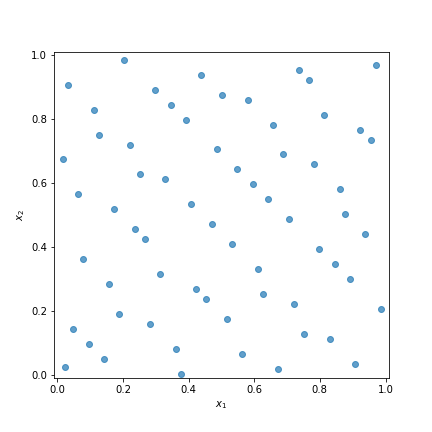

[](https://badge.fury.io/py/SobolSequence)
[](https://travis-ci.org/DavidWalz/sobol)
# Sobol
Concise implementation of the Sobol sequence for generating low-discrepancy quasi-random numbers in up to 1111 dimensions.

*Note*: `scipy>=1.7` features a [qmc module](https://scipy.github.io/devdocs/reference/stats.qmc.html) with a better Sobol implementation. 

### Install
```
pip install sobolsequence
```

### Usage 
```python
import sobol

sobol.sample(dimension=3, n_points=8)
array([[0.5   , 0.5   , 0.5   ],
       [0.75  , 0.25  , 0.75  ],
       [0.25  , 0.75  , 0.25  ],
       [0.375 , 0.375 , 0.625 ],
       [0.875 , 0.875 , 0.125 ],
       [0.625 , 0.125 , 0.375 ],
       [0.125 , 0.625 , 0.875 ],
       [0.1875, 0.3125, 0.3125]])
```

Skip the first `skip` points:
```python
X = sobol.sample(dimension=3, n_points=64, skip=1024)
plt.scatter(X[:, 0], X[:, 1]
```



Sample point by point using the underlying generator:
```python
sob = sobol.generator(dimension=5)
for i in range(8):
    print(next(sob))
```

### References
This implementation is based on the Python version by Corrado Chisari available [here](https://people.sc.fsu.edu/~jburkardt/py_src/sobol/sobol.html).
* Antonov, Saleev, USSR Computational Mathematics and Mathematical Physics,
  Volume 19, 1980, pages 252 - 256.
* Paul Bratley, Bennett Fox, Algorithm 659: Implementing Sobol's Quasirandom Sequence Generator,
  ACM Transactions on Mathematical Software, Volume 14, Number 1, pages 88-100, 1988.
* Bennett Fox, Algorithm 647: Implementation and Relative Efficiency of Quasirandom Sequence Generators,
  ACM Transactions on Mathematical Software, Volume 12, Number 4, pages 362-376, 1986.
* Ilya Sobol, USSR Computational Mathematics and Mathematical Physics,
  Volume 16, pages 236-242, 1977.
* Ilya Sobol, Levitan, The Production of Points Uniformly Distributed in a Multidimensional Cube (in Russian),
  Preprint IPM Akad. Nauk SSSR, Number 40, Moscow 1976.

The direction numbers from Joe and Kuo are available [here](https://web.maths.unsw.edu.au/~fkuo/sobol/).
* Stephen Joe and Frances Kuo, Remark on Algorithm 659: Implementing Sobol's quasirandom sequence generator, 
  ACM Trans. Math. Softw. 29, 49-57 (2003), http://doi.acm.org/10.1145/641876.641879
* Stephen Joe and Frances Kuo, Constructing Sobol sequences with better two-dimensional projections, 
  SIAM J. Sci. Comput. 30, 2635-2654 (2008), https://doi.org/10.1137/070709359
